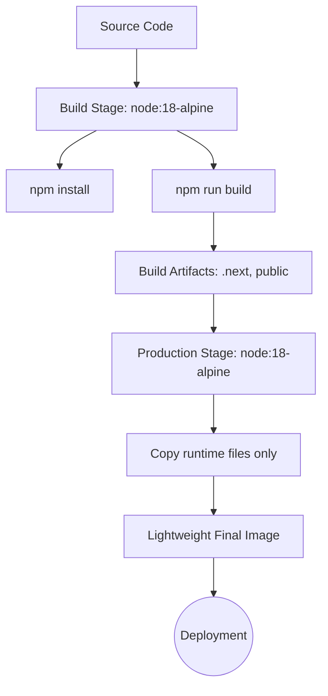

&nbsp;

# Multi-stage dockerfile nextjs
Building a **Next.js application** using a **multi-stage Docker build** makes your final image **lighter, faster, and more secure**.
This approach separates the **build stage** (with all dependencies & dev tools) from the **runtime stage** (minimal, production-only).

## Why Multi-Stage Builds?

- **Smaller image size** — build tools and dev dependencies are excluded.
- **Faster deployments** — smaller images mean quicker CI/CD pipeline runs.
- **Improved security** — only runtime dependencies are shipped.
- **Better caching** — Docker caches dependencies in early stages, reducing rebuild time.

```dockerfile filename="dockerfile"
# Stage 1: Dependencies
FROM node:18-alpine AS deps
COPY package*.json ./
RUN npm install --production

# Stage 2: Build
FROM node:18-alpine AS build
WORKDIR /app
COPY . .
COPY --from=deps /node_modules ./node_modules
RUN npm run build

# Stage 3: Production
FROM node:18-alpine AS prod
WORKDIR /app
COPY --from=build /app/.next/standalone ./
COPY --from=build /app/.next/static ./.next/static
COPY --from=build /app/public ./public

EXPOSE 3000
CMD ["node", "server.js"]
```

## Multi-Stage Build Workflow




### Next.js Configuration

Update your `next.config.js` to enable standalone output:

```javascript
/** @type {import('next').NextConfig} */
const nextConfig = {
  output: "standalone",
};

export default nextConfig;
```

## Build and Run

### Building the Docker Image

```bash
# Build the image
$ docker build -t nextjs-app .

# Check the image size
$ docker images | grep nextjs-app
```

### Running the Container

```bash
# Run in detach mode
$ docker run -d -p 3000:3000 nextjs-app
```
