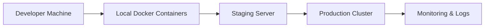

&nbsp;

# Local Development & Production Guide

Welcome to the **Local Development Guide**.
This documentation will serve as your **one-stop resource** for moving from local development setups to production-ready systems.

Unlike random blog posts, this guide brings together **rare, hard-to-find practices** that developers usually only learn after years of trial and error.

---

## 🌱 Introduction

Modern software development requires more than just writing code.
A successful developer needs to manage:

- **Databases** (SQL & NoSQL)
- **Servers** (local, staging, and production)
- **Containerization** (Docker & Kubernetes)
- **Cloud deployments** (AWS, GCP, Azure, Vercel, Netlify, etc.)
- **CI/CD pipelines**
- **Security & best practices**

This guide aims to **bridge the gap** between local development and production-ready systems.
It provides **step-by-step guides**, **best practices**, and **hands-on tutorials**.

---

## 🛠️ Setting Up Local Development

Local development is the foundation of everything. The goal is to have a **stable, reproducible, and isolated environment** that mirrors production as closely as possible.

## 🚀 Workflow Overview
